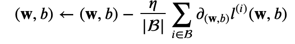

# 线性回归（linearRegression）  
---  
- <u>深度学习</u>是利用数据编程、数据驱动的一种机器学习算法。解决的问题主要包括分类和回归的问题。而我们本次要讨论的就是回归问题中最基本最简单的 - **线性回归**。  
本次学习线性回归的主要内容有：  
> * 线性回归的基本要素
> * 线性回归的简单实现
> * 线性回归的<u>PyTorch</u>实现  
## 1. 线性回归的基本要素
>### 模型  
> 为了解决线性回归的基本问题，我们需要构造线性回归模型去拟合我们数据的线性分布的特点。基于此，我们假设一个最简单的问题，市面上的房屋出售价格只与房子的大小、年限这两个因素（我们把它叫做特征）有关。（当然实际问题房子的出售价格影响因素有很多，包括朝向、户型、位置等），我们假设输出（房屋价格）与输入（问题中的大小、年限）呈线性关系:   

>### 数据集
> 我们通常收集一系列的真实数据，例如多栋房屋的真实售出价格和它们对应的面积和房龄。我们希望在这个数据上面寻找模型参数来使模型的预测价格与真实价格的误差最小。在机器学习术语里，该数据集被称为训练数据集（training data set）或训练集（training set），一栋房屋被称为一个样本（sample），其真实售出价格叫作标签（label），用来预测标签的两个因素叫作特征（feature）。特征用来表征样本的特点。 
>### 损失函数  
> 在模型训练中，我们需要衡量价格预测值与真实值之间的误差。通常我们会选取一个非负数作为误差,且数值越小表示误差越小。一个常用的选择是平方函数。它在评估索引为i样本误差的表达式为:   

>### 优化函数-随机梯度下降  
>当模型和损失函数形式较为简单时，上面的误差最小化问题的解可以直接用公式表达出来。这类解叫作解析解（analytical solution）。本节使用的线性回归和平方误差刚好属于这个范畴。然而，大多数深度学习模型并没有解析解，只能通过优化算法有限次迭代模型参数来尽可能降低损失函数的值。这类解叫作数值解（numerical solution）。在求数值解的优化算法中，小批量随机梯度下降（mini-batch stochastic gradient descent）在深度学习中被广泛使用。它的算法很简单：先选取一组模型参数的初始值，如随机选取；接下来对参数进行多次迭代，使每次迭代都可能降低损失函数的值。在每次迭代中，先随机均匀采样一个由固定数目训练数据样本所组成的小批量（mini-batch），然后求小批量中数据样本的平均损失有关模型参数的导数（梯度），最后用此结果与预先设定的一个正数的乘积作为模型参数在本次迭代的减小量。  
 
>学习率:  𝜂 代表在每次优化中，能够学习的步长的大小批量大小:是小批量计算中的批量大小 batch size
总结一下，优化函数的有以下两个步骤：  
(i)初始化模型参数，一般来说使用随机初始化；  
(ii)我们在数据上迭代多次，通过在负梯度方向移动参数来更新每个参数。

## 2. 线性回归的简单实现
>具体的代码实现，在文件的code中，主要是按照线性回归的问题的分析思路，深度学习模型构建方法，能够更好的理解模型和神经网络底层的原理。
## 3. 线性回归的PyTorch实现
> 而PyTorch实现，主要是利用Pytorch深度学习库，很多模型和函数已经集成了，方便我们更快的进行设计和实现模型。代码也在code文件夹中。